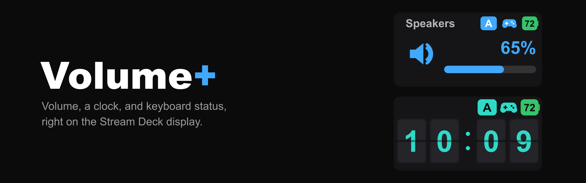

# Volume+

**Volume+** is a Stream Deck plugin, a full replacement for Elgato's Volume
Controller, built for keyboards with a built-in Stream Deck (like the Corsair
Galleon 100 SD) where the Caps Lock light disappears once the Stream Deck
software takes over the panel. Every widget can show Caps Lock, Game Mode, and
wireless headset battery status right on the touch display, all in accent
colors you pick.

**Get it on the Elgato Marketplace:**
https://marketplace.elgato.com/product/volume-eb2f8e95-7378-4b9f-9842-d8eefd78cc17

This repository is **support only**: bug reports, feature requests, and headset
compatibility. The plugin is a closed-source commercial product; there's no
plugin code here.

## Widgets

- **Volume**: pick any output device, turn the dial to adjust by a percentage
  step you set, press or tap to mute. Works on a plain key too.
- **Clock**: several faces (big digital, digital + date, analog, minimal
  analog, analog + digital, day-progress ring, flip clock). 12/24-hour,
  seconds, date formats, any time zone, transparent or solid background.

Both widgets can show up to three status badges:

- **Caps Lock**: read the same way any Windows app reads keyboard state.
- **Game Mode**: reflects a Corsair "Game Mode" Stream Deck action's on/off
  state (needs that action somewhere on a page; nothing to configure otherwise).
- **Headset battery**: a wireless headset's charge %, over raw HID, no vendor
  software. See the table below.

More widgets (Microphone, Timer, Date, and others) are on the roadmap. The
Marketplace listing is the source of truth for what's shipping right now.

## Headset battery: supported devices

Autodetected, no need to pick your headset from a list. The plugin's settings
panel shows which headset it currently sees.

| Headset | Status |
| --- | --- |
| SteelSeries Arctis 7 / Arctis 7 (2019) / Arctis Pro (2019) / Arctis Pro GameDAC | ✅ Verified on hardware |
| SteelSeries Arctis Nova 7 | 🧪 Beta |
| HyperX Cloud Flight Wireless | 🧪 Beta |
| HyperX Cloud II Wireless (HP-branded and Kingston-branded) | 🧪 Beta |
| HyperX Cloud Alpha Wireless | 🧪 Beta |

**Beta** means the protocol is implemented from public documentation but nobody
has confirmed it on the actual headset yet. Beta profiles ship **disabled** and
never run by default, because a wrong number is worse than no number. Want yours
enabled? [Open a headset issue](../../issues/new/choose) and help confirm it,
it's usually a two-minute check. See [CONTRIBUTING.md](CONTRIBUTING.md) for the
steps, [`tools/headset-probe.py`](tools/headset-probe.py) for capturing raw HID
bytes, and [`docs/headset-protocols.md`](docs/headset-protocols.md) for the
protocol details.

Only wireless headsets on their own USB dongle are in scope. Bluetooth and wired
connections don't expose battery over this path.

Protocol facts (device IDs, report bytes, offsets) are documented, not
reverse-engineered from scratch, thanks to the
[HeadsetControl](https://github.com/Sapd/HeadsetControl) project. Volume+'s
reader is written independently (no GPL code is used; HeadsetControl is GPLv3
and this plugin is closed-source), but the device research is theirs. Anything
new we work out, we aim to contribute back.

## Privacy

Volume+ does not phone home. No telemetry, no analytics, no network requests.

- **Caps Lock / Num Lock state** is read with a standard Windows call, the same
  one any application can make. Volume+ does not intercept or log keystrokes.
- **Headset battery** is a single small HID message to the headset's own USB
  dongle. Nothing is written to the keyboard.
- **Game Mode** is read from Stream Deck's own on-disk profile file, not from
  the keyboard's hardware.

Everything runs inside the Stream Deck plugin process. There is no background
service, and nothing to sign into.

## FAQ / Troubleshooting

**The headset badge doesn't appear.**
Make sure "Headset battery badge → Show" is ticked in the widget's settings,
the headset is powered on, and it's connected via its USB dongle (not
Bluetooth). The settings panel will say which headset it detected; if it says
"none detected", the dongle isn't being seen.

**The headset % is wrong or stuck.**
If your headset is a Beta entry above, that's expected, it's not confirmed yet.
Please open a headset issue. If it's the verified Arctis 7 and the number is
off, definitely open an issue.

**The Game Mode badge never shows.**
It only appears when a Corsair "Game Mode" action is present on one of your
Stream Deck pages, and (unless you set the badge to "Always") when that action
is on. No Corsair action, no badge.

**Does it work on a regular Stream Deck / Stream Deck + / MK.2 / XL / Neo?**
Yes. The dial interactions use an encoder where one exists; on plain keys the
same widgets render as a key image. Volume and the Caps Lock badge are
Windows-only for now.

**macOS?**
Planned. The Clock and Game Mode badge already run cross-platform; Volume and
Caps Lock need a Mac backend.

## Reporting an issue

Use [the issue templates](../../issues/new/choose). Helpful details:

- Windows version, Stream Deck app version, Volume+ version.
- Which widget (Volume / Clock) and whether it's on a dial or a key.
- For a headset: exact model, and confirm it's on the USB dongle.
- What you expected vs. what happened. A screenshot of the widget helps.

For headset support work specifically, [CONTRIBUTING.md](CONTRIBUTING.md) covers
confirming a Beta model, adding a new one, and the read-only
[`tools/headset-probe.py`](tools/headset-probe.py) helper.

## License

© 2026 Mega-City Merchandise LLC. Volume+ is a commercial product; this
repository is for support purposes only and does not contain the plugin's
source code. See [LICENSE](LICENSE). The `tools/` directory is separately
licensed under the MIT License ([tools/LICENSE](tools/LICENSE)).
